** 

**Apache Iceberg Tables**

Apache Iceberg is an open-source table format that brings ACID transactions, time travel, schema evolution, and partition evolution to data lakes. This comprehensive guide covers Iceberg architecture, hands-on implementation across cloud platforms (AWS S3, Azure Data Lake Storage, Google Cloud Storage), and integration with Snowflake external volumes for enterprise data governance.

- ` `**Introduction to Apache Iceberg**

**What is Apache Iceberg?**

Apache Iceberg is a table format designed to overcome the limitations of using raw Parquet or ORC files directly in a data lake, while still storing data in familiar formats such as Parquet, Avro, and ORC. It provides:

- **ACID Transactions**: Guarantees data consistency across concurrent readers and writers
- **Time Travel**: Query data at any point in time for auditing and recovery
- **Schema and Partition Evolution**: Modify table structures without breaking existing queries
- **Hidden Partitioning**: Automatic partition pruning without exposing partition columns to users
- **Open Format**: Language and engine-agnostic (Spark, Flink, Trino, Presto, Snowflake)

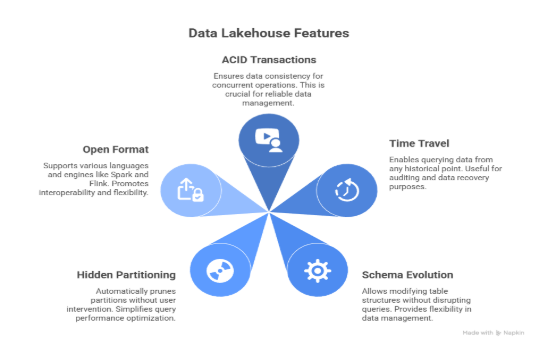

` `**Why Iceberg Matters**	

Traditional data lakes suffer from:

- Slow queries due to large file listings
- Data consistency issues with concurrent writes
- Difficulty evolving schemas without downtime
- Partition management complexity

Iceberg solves these through a metadata-driven approach.

**Evolution of Modern Data Architectures**

Apache Iceberg plays a central role in enabling the data Lakehouse by bringing warehousegrade features such as ACID transactions, time travel, and schema evolution directly to cloud data lakes. By standardizing table metadata and access across engines, Iceberg turns raw object storage into a governed, analyticsready layer that supports BI, data science, and machine learning on the same data.

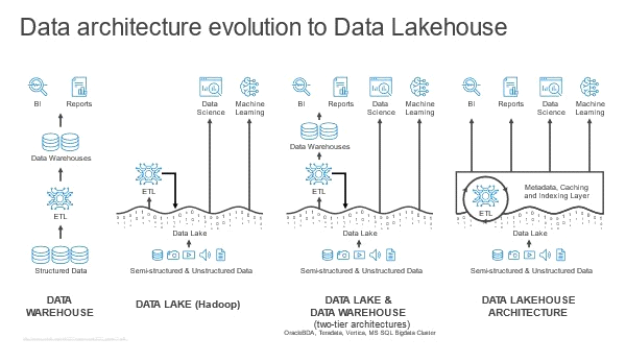
**\

- **Apache Iceberg Architecture**

This diagram illustrates Snowflake Iceberg Tables as a central, feature-rich data layer offering capabilities like ACID transactions, time travel, and schema evolution. It highlights the tables' seamless interoperability, connecting Snowflake's ingestion and transformation tools with external storage and analytics services across AWS, Azure, and GCP cloud platforms.

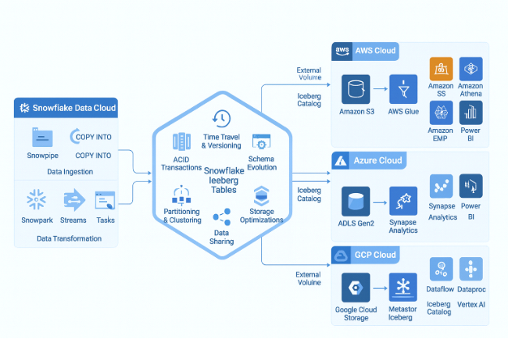

**2.1 Three-Layer Architecture**

Apache Iceberg uses a metadata-first design with three core layers:

**Layer 1: Catalog**

The catalog is the single source of truth for table metadata. It manages:

- **Namespace Management**: Organization of tables into databases
- **Table References**: Pointers to the latest metadata file location
- **Catalog Implementations**:
- 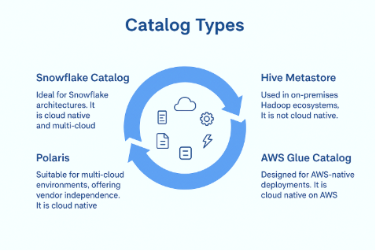

**Layer 2: Metadata Layer**

**Apache Iceberg is neither a storage engine nor an execution engine.**

The below diagram illustrates the Apache Iceberg table format architecture, presenting both logical and physical views of data management. The flow initiates at the Iceberg Catalog, which maintains a pointer to the current metadata JSON file. Subsequent metadata files define snapshots and reference manifest lists, which in turn track specific manifest files. This hierarchical metadata structure ultimately locates the individual parquet data files stored in the data layer. The numbered steps highlight the precise path Iceberg uses to resolve the current state of a table down to its specific files.

Metadata files track table state without modifying data files. Key components:

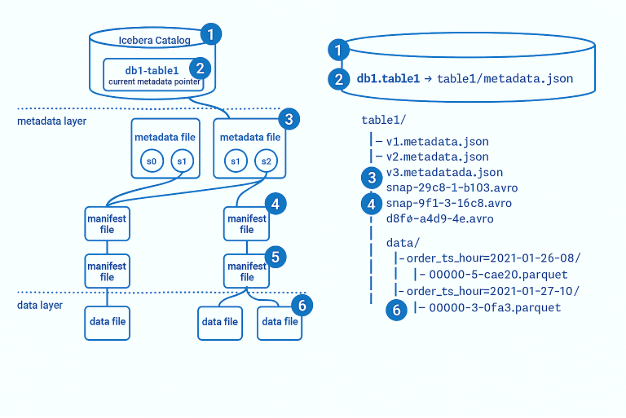

**Layer 3: Data Layer**

The data layer stores actual table data:

- **Data Files**: Parquet, ORC, or Avro format
- **Location**: S3 buckets (AWS), ADLS (Azure), GCS (Google Cloud), HDFS
- **Immutability**: Data files are write-once (new files for updates/deletes)
- **File Organization**: Automatic partitioning managed by Iceberg

**2.2 Time Travel and Snapshots**

Iceberg maintains complete table history through immutable snapshots, enabling point-in-time queries and recovery.

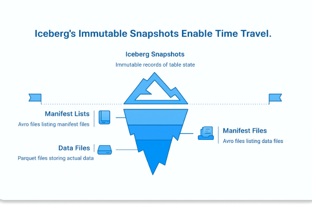

**2.3 Schema and Partition Evolution**

- **Schema Evolution**: Add, remove, rename, or reorder columns without rewriting data
- **Partition Evolution**: Change partitioning scheme without full table reorganization
- **Type Promotion**: Safely promote integer to long, float to double

** 

- **Iceberg Integration and Ecosystem**

**3.1 Integration with Data Processing Engines**

Iceberg's engine-agnostic design enables seamless integration with multiple data processing frameworks:

- **Iceberg on Cloud Platforms**

This diagram compares AWS S3, Azure ADLS, and Google GCS as cloud storage options for Apache Iceberg metadata, summarizing their key capabilities. It helps readers choose a platform by highlighting strengths like versioning, IAM/RBAC, lifecycle policies, diagnostics, and audit logging.

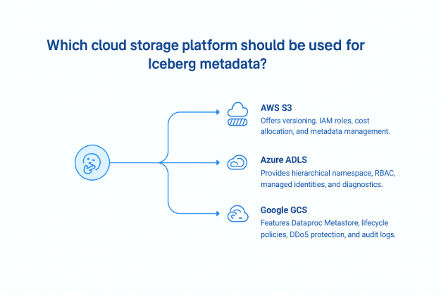

- **Snowflake + Iceberg + External Volumes**
- **Snowflake as Iceberg Catalog**

Snowflake natively supports Apache Iceberg tables and can serve as the central catalog across multiple cloud providers:

**Key Features:**

- **Native Iceberg Support**: Create, manage, and query Iceberg tables directly in Snowflake
- **Time Travel**: Query historical versions of Iceberg tables using AT or BEFORE clauses
- **Dynamic Tables**: Use Snowflake's dynamic tables with Iceberg for automated refresh logic
- **Cortex Functions**: Leverage Snowflake's AI/ML capabilities on Iceberg data
- **Multi-Cloud**: External volumes enable Iceberg tables on AWS S3, Azure ADLS, and GCS from single Snowflake instance
- **External Volumes** 

External volumes are Snowflake objects that define a secure connection to cloud storage locations where Iceberg data and metadata physically live (S3, ADLS, or GCS). They decouple storage configuration from table DDL and are referenced whenever an Iceberg table is created on external storage.​

**Key Points**

- Represent a bucket/container or path plus the credentials/IAM role Snowflake uses to access it.​
- Multiple Iceberg tables can share one external volume, or you can create separate volumes per environment (dev/test/prod) or domain for isolation.​
- Same concept across clouds: S3-based, ADLS-based, and GCS-based external volumes with similar syntax.​
- Required before creating Iceberg tables that store files outside Snowflake; you reference it via EXTERNAL\_VOLUME = '<name>' in CREATE ICEBERG TABLE.​
- **Data Governance and Access Control** 
- **Snowflake Role-Based Access Control (RBAC)**

  Snowflake uses role-based access control to grant specific privileges on tables to roles like analyst (read-only), engineer (read/write), or admin (full control).

- Create custom roles for analysts, engineers, and admins.
- Grant SELECT to analysts, INSERT/UPDATE to engineers, and OWNERSHIP to admins on Iceberg tables.
- Assign users to these roles so their queries only access permitted data.
- Use row and column policies for granular control of sensitive columns (like customer info), ensuring only the right roles see certain data.​
- **Cloud-Level Permissions**

  Align Snowflake RBAC with your cloud IAM:

- AWS: Use Lake Formation/IAM to grant only Snowflake access to S3 data paths.
- Azure: Assign ADLS permissions via RBAC/ACLs to Snowflake's managed identity.
- GCP: Grant appropriate GCS roles (objectViewer, objectAdmin) to Snowflake service accounts.

Combine Snowflake grants with cloud permissions to ensure only approved users and roles can query or modify Iceberg data across clouds.​

- **Performance Optimization**
- **Partition Pruning**

Iceberg stores partition and file statistics in metadata, so Snowflake can skip entire partitions that do not match query filters. This means a query like:

**SELECT** COUNT(\*) 

**FROM** iceberg\_sales

**WHERE** sale\_date = '2024-12-01';

only scans the files for that date instead of the full table, which greatly reduces I/O and improves performance.​

- **Statistics and Metadata Optimization**

To keep pruning effective and the optimizer accurate, periodically refresh metadata and compact small files:

- ANALYZE TABLE iceberg\_sales COMPUTE STATISTICS; recomputes statistics so the optimizer has uptodate row counts and data distribution.
- ICEBERG\_MANIFEST\_ENTRIES('iceberg\_sales') lets you inspect file sizes, record counts, and partition values to spot many tiny files or skewed partitions.
- CALL system$optimize('iceberg\_sales', 'MIN\_INPUT\_FILES=10'); compacts small files into fewer larger ones, which improves scan efficiency and reduces metadata overhead.​
- **Caching Strategies**

Snowflake uses several layers of caching to speed up Iceberg queries:

- **Metadata Caching**: Snowflake caches manifest lists for faster query planning
- **Data Caching**: Result caching for repeated identical queries
- **Iceberg Manifest Caching**: Reduces repeated manifest file reads
- **Monitoring and Troubleshooting**
- **Snowflake Monitoring**

Use Snowflake metadata to keep an eye on Iceberg tables:

- Table health: query INFORMATION\_SCHEMA.TABLES (or SHOW ICEBERG TABLES) to see row counts, bytes, and file counts for all Iceberg tables in a schema. This quickly highlights very large tables or sudden growth.
- Query performance: use SNOWFLAKE.ACCOUNT\_USAGE.QUERY\_HISTORY filtered on query\_text LIKE '%iceberg%' and a recent time window to review execution time, bytes scanned, and partitions scanned, helping you tune partitions and optimize slow workloads.​
- **Cloud Storage Monitoring**

Pair Snowflake monitoring with cloudnative observability:

- AWS: CloudWatch metrics and logs track S3 request volume, latency, and errors, and can alert on excessive LIST or failed calls.
- Azure: Azure Monitor provides storage account ingress/egress, latency, and diagnostic logs for ADLS Gen2 used by Iceberg tables.
- GCP: Cloud Monitoring and Cloud Logging expose GCS bucket metrics, access logs, and error/latency dashboards for Iceberg data paths.​

These views together show both SQLlevel behaviour in Snowflake and storagelevel health in each cloud, making it easier to detect performance regressions or access issues for Iceberg tables.

- **Common Issues and Solutions**

- **Best Practices and Recommendations**
- **Design Principles**
- Choose Right Catalog: Use Polaris for multi-cloud, AWS Glue for AWS-only, Snowflake for integrated platform
- Partition Strategy: Design partitions for query patterns (date, region, customer segment)
- Write Model: Use COW for OLAP/batch, MOR for OLTP/streaming
- Metadata Management: Monitor metadata file growth; compact regularly
- Cost Optimization: Set lifecycle policies for old snapshots; archive historical data
- **Snowflake + Multi-Cloud Strategy**
- Centralize catalog in Snowflake for unified governance
- Use external volumes for hybrid/multi-cloud deployments
- Implement dynamic tables for automated data refresh
- Leverage Cortex Analyst for AI-powered analytics on Iceberg data
- Use Snowflake as single pane of glass for access control across clouds
- **Migration Path from Legacy Formats**
- Assessment: Identify tables to migrate (Hive, Delta, Parquet)
- Parallel Setup: Create Iceberg tables alongside existing tables
- Incremental Migration: Migrate high-priority tables first
- Validation: Run parallel queries to validate data correctness
- Cutover: Redirect applications to Iceberg tables
- Cleanup: Archive old format tables after stabilization
- **real-world use cases**
- **Financial Services: Multi-Region Risk Analytics**
- Data ingestion from AWS (transaction data) → Iceberg on S3
- Risk calculations via Azure Databricks → Iceberg on ADLS
- Reporting via Snowflake → Query both tables natively
- Time travel for regulatory compliance audits
- Schema evolution for new risk metrics
- **E-Commerce: Real-Time Customer Analytics**
- Kafka streaming → AWS Iceberg tables (via Flink)
- Customer profiles → Azure Iceberg (ADLS)
- Personalization ML models → GCS Iceberg (BigQuery)
- Snowflake orchestration with dynamic tables
- Cross-cloud joins for 360-degree customer view
- **Healthcare: HIPAA-Compliant Data Governance**
- Patient records on compliant cloud (AWS, Azure, GCS as needed)
- Iceberg provides immutable audit trail via time travel
- Row-level security with Snowflake RBAC for HIPAA compliance
- Snapshot retention for data recovery and forensics
- Schema evolution for new medical coding standards
- **Why Iceberg Stands Out Among Table Formats**
**\
\
Building on successes like Apache Parquet, Iceberg stands out for its full vendor independence. This open governance model fosters broad community development, accelerating innovation and adoption

**Engine-agnostic access:** Any application can read or write Iceberg tables, enabling organizations to choose the tools they prefer and design a data lake architecture that fits their needs.

**Built-in performance optimizations:** Iceberg incorporates best practices that deliver fast, efficient, and cost-effective data access at scale.

**Storage-agnostic design:** With no dependency on a particular file system, Iceberg supports flexibility when selecting or migrating cloud and on-premises storage systems.

**Proven at massive scale:** Iceberg already powers production deployments managing tens of petabytes of data and millions of partitions.

** 

- **Why Apache Iceberg Matters for Data Warehousing**

Apache Iceberg is an **open table format** designed to manage huge analytic tables on cloud storage (S3 / ADLS / GCS) with **warehouse-grade capabilities**.

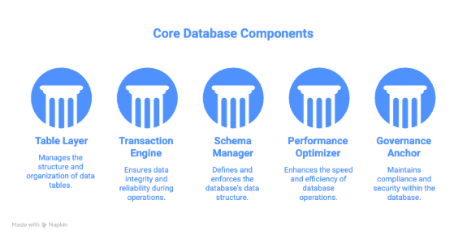

- **Supports Real Warehouse Operations**

  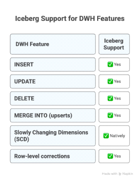
  **\
 

- **Iceberg vs Traditional DWH Tables**

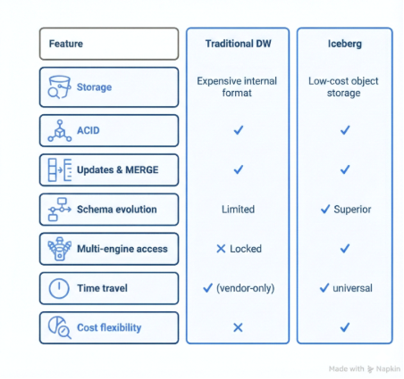

- **Why Iceberg Is Most Valuable for Data warehousing**

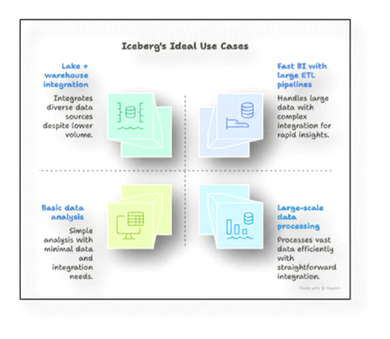

- **Conclusion**

Apache Iceberg represents a paradigm shift in data lake management by combining the simplicity of data lakes with the reliability of data warehouses. When combined with Snowflake's unified platform and external volumes across AWS, Azure, and GCS, organizations can build truly cloud-agnostic, scalable, and governed data platforms.

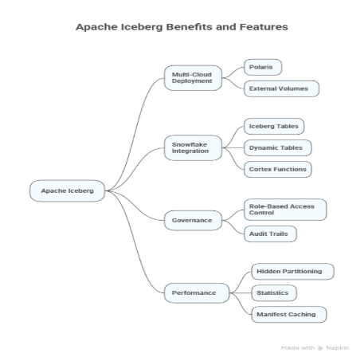

Key takeaways:

- **Iceberg Architecture**: Metadata-driven three-layer design enables ACID, time travel, and schema evolution
- **Multi-Cloud Deployment**: Polaris and external volumes enable consistent Iceberg deployment across cloud providers
- **Snowflake Integration**: Native support for Iceberg tables, dynamic tables, and cortex functions simplifies operations
- **Governance**: Role-based access control and audit trails ensure compliance and data security
- **Performance**: Hidden partitioning, statistics, and manifest caching optimize query performance

Organizations adopting Iceberg can expect reduced operational complexity, improved data governance, and faster time-to-insight across hybrid and multi-cloud environments.

